# A2A TASKS GO SDK



Reusable Spanner-backed task persistence for `github.com/a2aproject/a2a-go/v2`.

## Package shape

- `SpannerService` owns the raw Spanner schema and CRUD/query logic.
- `SpannerTaskStore` implements `a2asrv/taskstore.Store`.
- `SpannerPushConfigStore` implements `a2asrv/push.ConfigStore`.
- `HTTPPushSender` implements `a2asrv/push.Sender`.

## Usage

```go
spannerSvc, err := tasks.NewSpannerService(ctx, tasks.SpannerConfig{
    Project:  projectID,
    Instance: instanceID,
    Database: databaseID,
})
if err != nil {
    return err
}

taskStore := tasks.NewTaskStore(spannerSvc)
pushStore := tasks.NewPushConfigStore(spannerSvc)
sender := tasks.NewHTTPPushSender()
```
